# LightmapperToy

This project is a hobby lightmapper completely based on Houdini VEX nodes. Basically it grew out of a re-implementation of <a href="https://github.com/TheRealMJP/BakingLab" target="_blank">Matt's The Baking Lab</a> with some modification. It's my first houdini project so there is no magic (no GPU acceleration, no progressive, just brute force) :(

# How To Use It

There are just four nodes inside the obj tab:

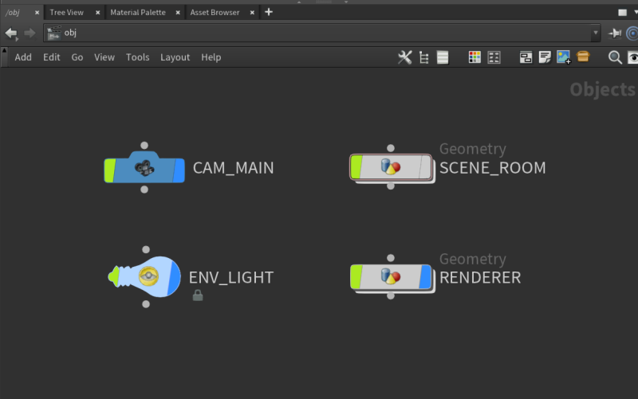

The SCENE_ROOM node is responsible for setting up the scene geometries (click the "Room Object" menu to change different scenes, toggle the "Enable Light" to enable or hide the area light on the top):

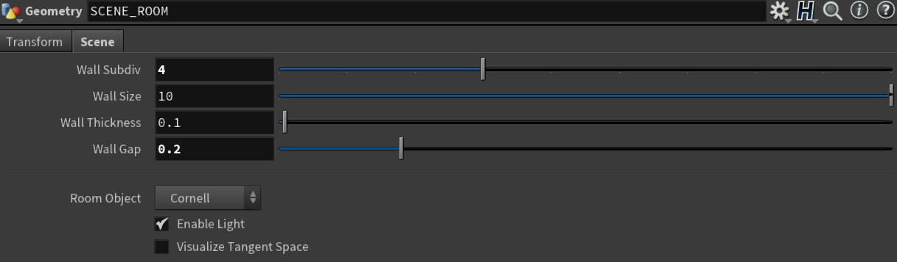

The RENDERER node is responsible for all the calculating. Change the "Shading Method" menu to switch between path tracer and lightmapper. More detail settings are under "Ground Truth" and "Lightmap Baker" tabs:

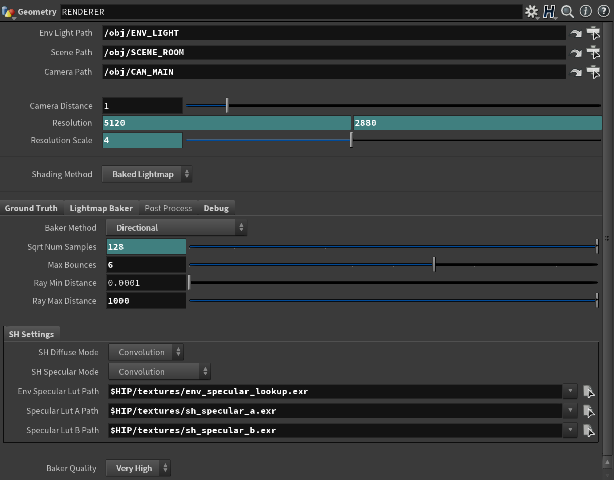

# Results

We compare the lighting results of all the methods. As usual, ground truth goes first.

## Path Tracer

| Cornell | Toy  | Shaderball | Path Tracer |
| --- | ---  | --- | --- |
|  |  |  | Diffuse & Specular |
| 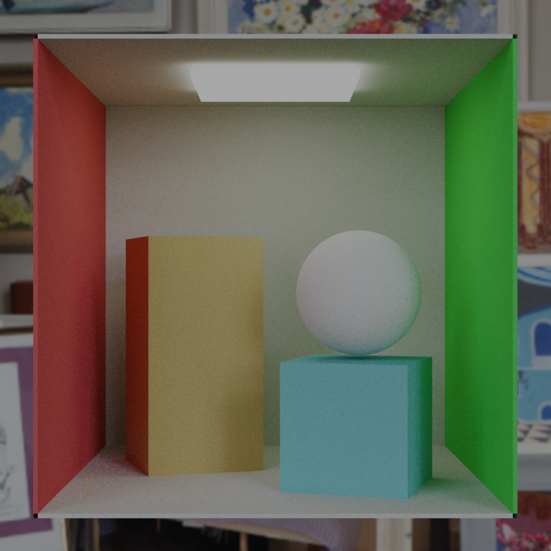 | 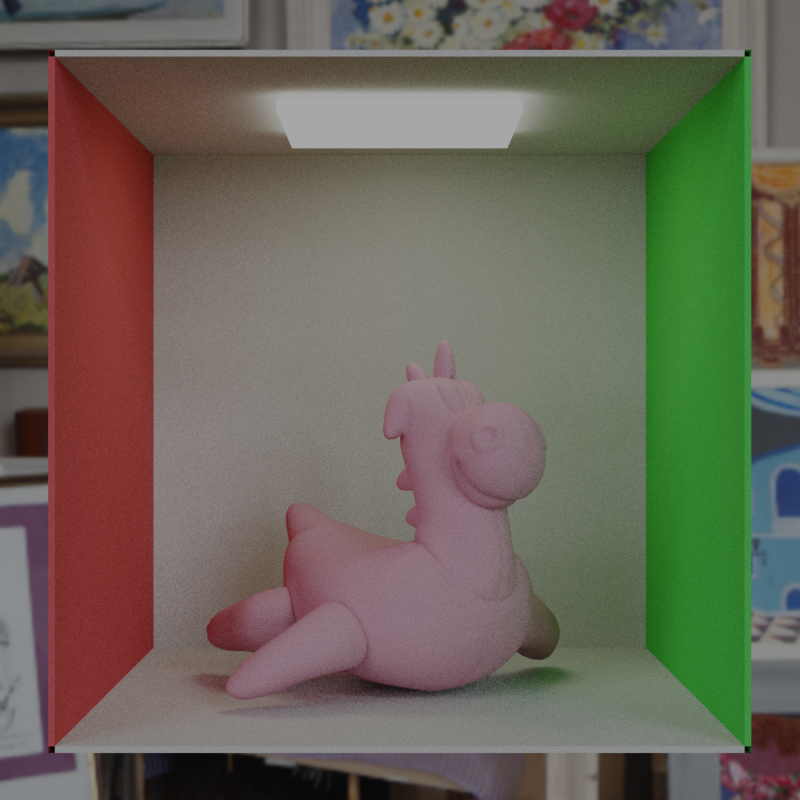 | 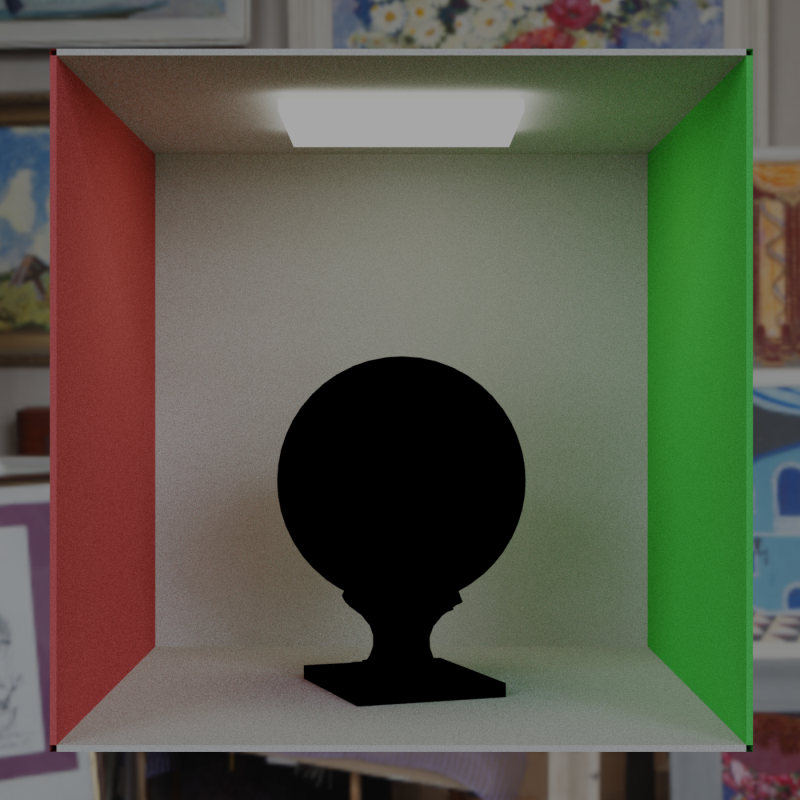 | Diffuse Only |
| 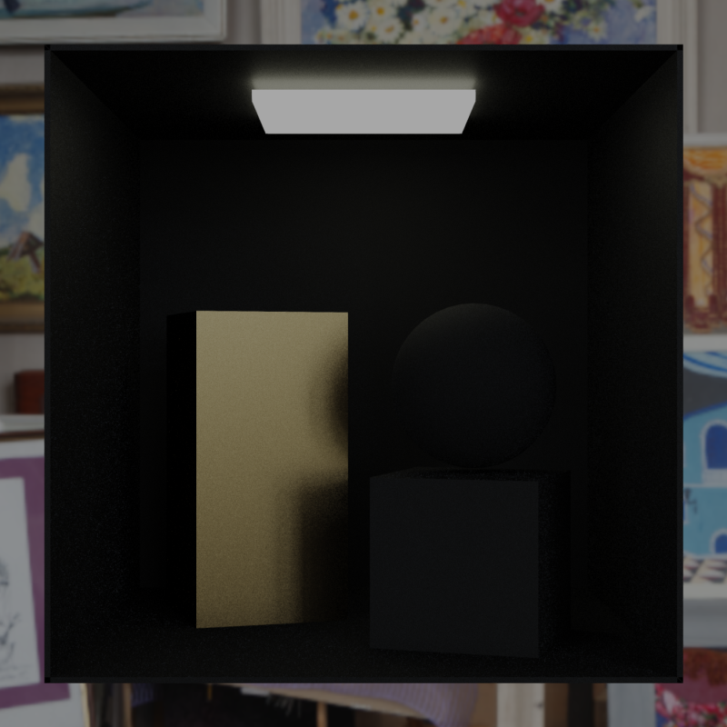 |  | 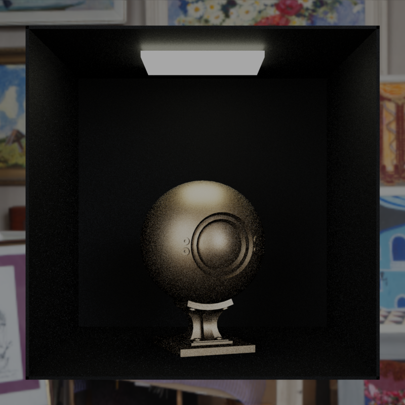 | Specular Only |

## Diffuse Baker

"Diffuse" uses a single RGB value containing the result of applying a standard diffuse BRDF to the incoming lighting, with an albedo of 1.0 (3 floats per point).

| Cornell | Toy  | Shaderball | Diffuse |
| --- | ---  | --- | --- |
|  |  |  | Diffuse & Specular |
| -- | -- | -- | Diffuse Only |
| No Specular | No Specular | No Specular | Specular Only |

### Directional Baker

"Directional" bakes irradiance based on Enlighten's directional approach, with 3 floats for color, 3 for lighting main direction information, and 1 float to ensure that the directional term evaluates to 1 when the surface normal aligns with normal used when baking (7 floats per point)

| Cornell | Toy  | Shaderball | Directional |
| --- | ---  | --- | --- |
|  |  |  | Diffuse & Specular |
| 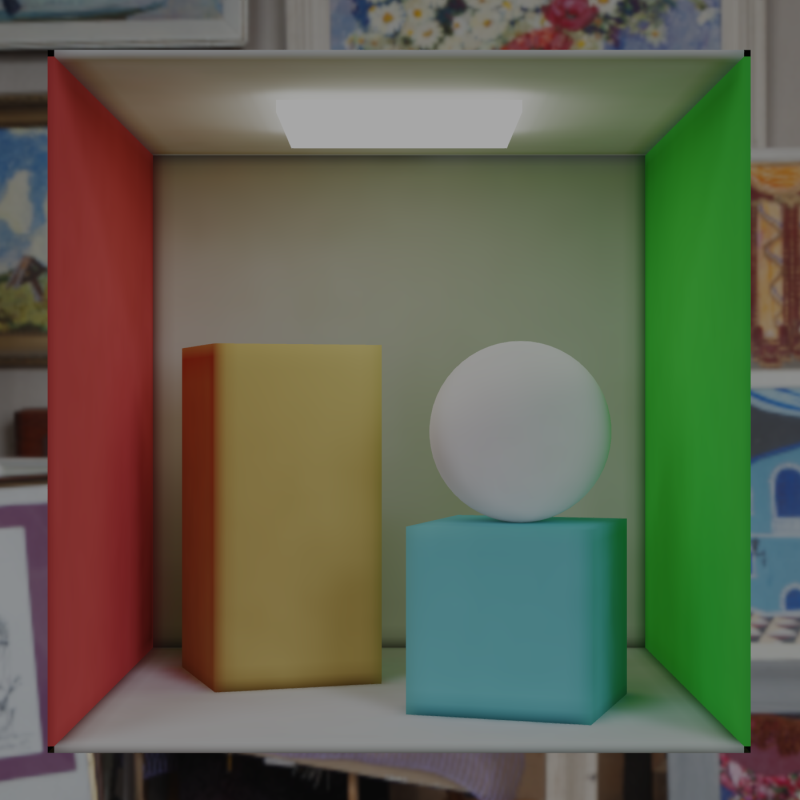 | 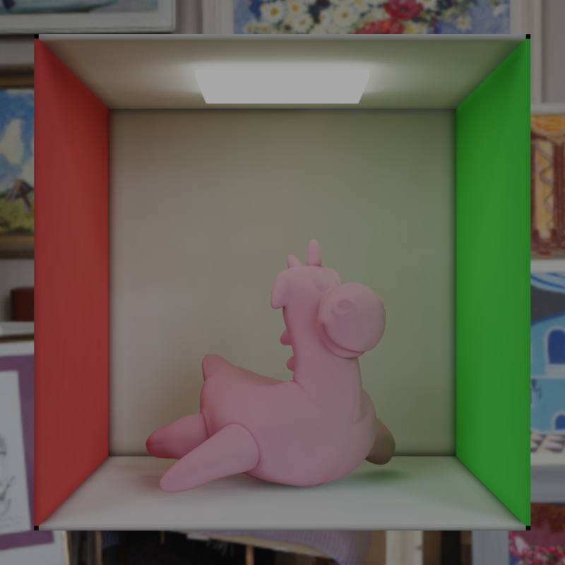 | 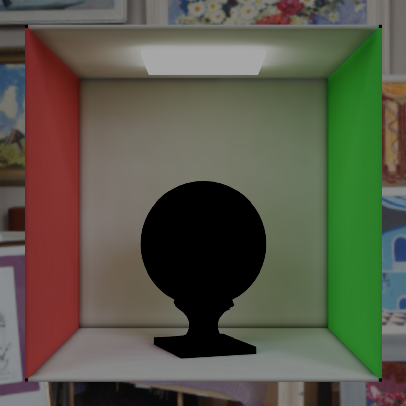 | Diffuse Only |
| 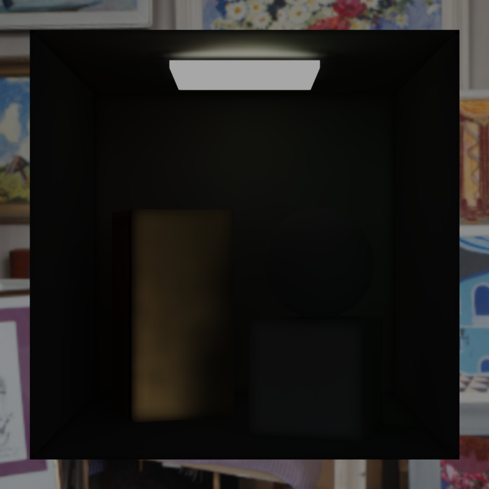 | 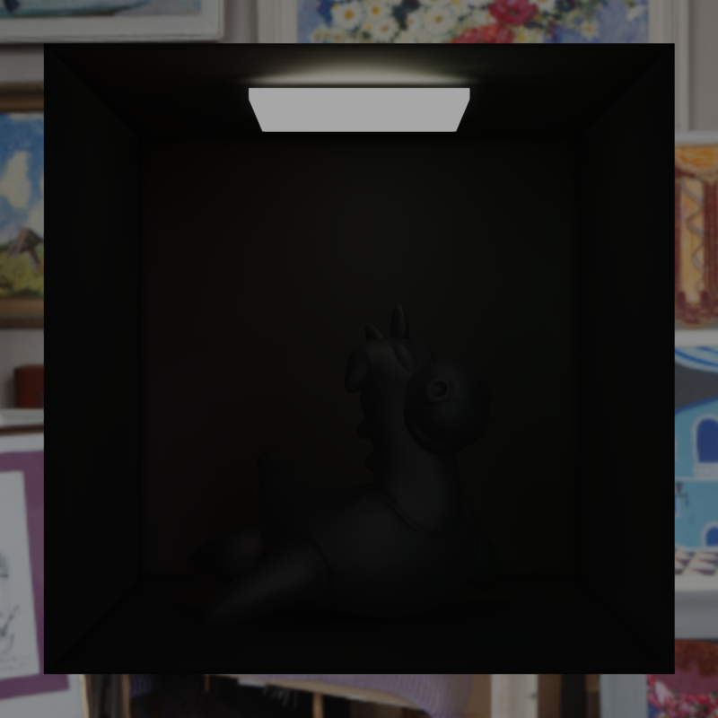 | 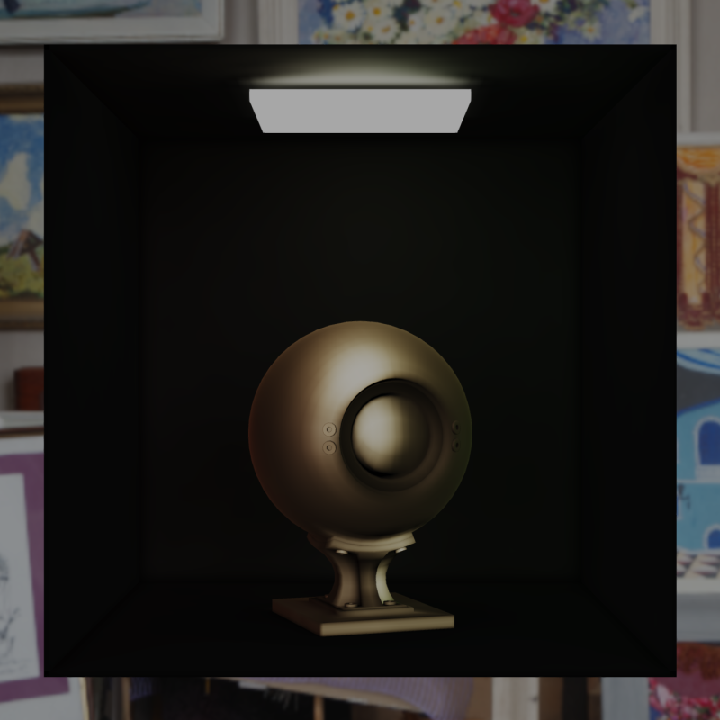 | Specular Only |

### Half-Life 2 Baker

"Half-Life 2" bakes irradiance projected onto the Half-Life 2 basis, making for a total of 3 sets of RGB coefficients (9 floats per point).

| Cornell | Toy  | Shaderball | Half-Life 2 |
| --- | ---  | --- | --- |
|  |  |  | Diffuse & Specular |
| -- | -- | -- | Diffuse Only |
| No Specular | No Specular | No Specular | Specular Only |

### SH L1/L2 Baker

"SH" bakes irradiance projected onto L1 SH (12 floats per point) or L2 SH basis (27 floats per point). SH spports 3 diffuse modes and 5 specular modes to shading. There are too many possible combinations of diffuse and specular modes (3 x 5), so I just use the default modes (convolution for both diffuse and specular) for the first row.

| Cornell | Toy  | Shaderball | SH L2 |
| --- | ---  | --- | --- |
|  |  |  | Diffuse & Specular |
|  |  |  | Diffuse (Convolution) |
|  |  |  | Diffuse (Geomerics) |
|  |  |  | Diffuse (AHD) |
|  |  |  | Specular (Convolution) |
|  |  |  | Specular (Dominant) |
|  |  |  | Specular (Punctual) |
|  |  |  | Specular (Prefiltered) |
|  |  |  | Specular (AHD) |

## H-basis L1/L2 Baker

TODO

## SG Baker

TODO

# References

[1] <a href="https://mynameismjp.wordpress.com/2016/10/09/sg-series-part-6-step-into-the-baking-lab/" target="_blank">SG Series Part 6: Step Into The Baking Lab</a>
[2] <a href="https://www.ppsloan.org/publications/StupidSH36.pdf" target="_blank">Stupid Spherical Harmonics (SH) Tricks</a>
[3] <a href="https://seblagarde.wordpress.com/2011/10/09/dive-in-sh-buffer-idea/" target="_blank">Dive in SH Buffer Idea</a>
[4] <a href="https://www.ea.com/frostbite/news/precomputed-global-illumination-in-frostbite" target="_blank">Precomputed Global Illumination in Frostbite</a>
[5] <a href="http://miciwan.com/SIGGRAPH2013/Lighting%20Technology%20of%20The%20Last%20Of%20Us.pdf" target="_blank">Lighting Technology of The Last of Us</a>